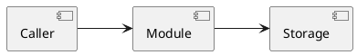
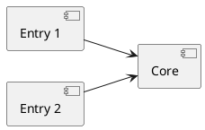
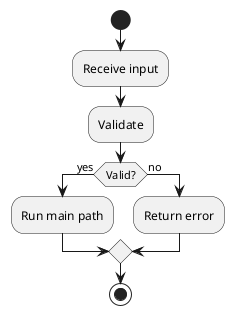

# 图形模板

## 架构图模板

```plantuml
@startuml
left to right direction
skinparam shadowing false

component "Caller" as Caller
component "Module" as Module
component "Storage" as Storage

Caller --> Module
Module --> Storage
@enduml
```

## 接入点图模板

```plantuml
@startuml
left to right direction
skinparam shadowing false

component "Entry 1" as E1
component "Entry 2" as E2
component "Core" as Core

E1 --> Core
E2 --> Core
@enduml
```

## 流程图模板

```plantuml
@startuml
start
:Receive input;
:Validate;
if (Valid?) then (yes)
  :Run main path;
else (no)
  :Return error;
endif
stop
@enduml
```

## 前后对照图模板

前后对照时，保持两个 `.puml` 文件同名但加后缀：

- `feature-before.puml`
- `feature-after.puml`

分别渲染成对应的 `.md`，再在总文档里并排展示。
