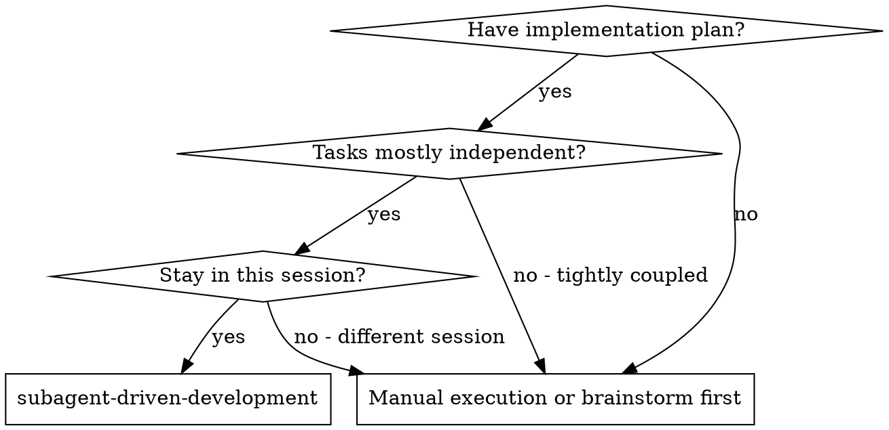
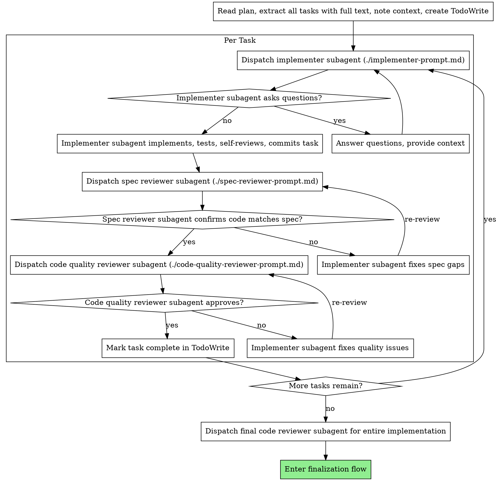

# 子代理驱动开发

通过为每个任务派发新的子代理来执行计划，并在每个任务后进行两阶段审查：先做规格符合性审查，再做代码质量审查。每个任务在完成并通过审查后，都要单独 `commit` 一次。

**为什么用子代理：** 你把任务委派给上下文隔离的专门代理。通过精确构造它们的指令和上下文，可以让它们保持聚焦并顺利完成任务。它们不应该继承你的会话上下文或历史记录，而是只接收完成任务所需的内容。这也能保留你自己的上下文，用于协调工作。

**核心原则：** 每个任务都用新子代理 + 两阶段审查（先规格后质量）+ 单任务独立 commit = 高质量、快速迭代

## 何时使用



## 流程



## 模型选择

每个角色都用能胜任的最弱模型，这样更省成本、速度更快。

**机械实现任务**（孤立函数、规格清晰、1-2 个文件）：用快速、便宜的模型。只要计划写得足够清楚，大多数实现任务本质上都是机械活。

**集成和判断任务**（多文件协调、模式匹配、调试）：用标准模型。

**架构、设计和审查任务**：用当前最强的模型。

**任务复杂度信号：**
- 只涉及 1-2 个文件，而且规格完整 → 便宜模型
- 涉及多个文件，还要处理集成问题 → 标准模型
- 需要设计判断或广泛理解代码库 → 最强模型

## 处理实现者状态

实现者子代理会返回 4 种状态。要分别处理：

**DONE：** 进入规格符合性审查。

**DONE_WITH_CONCERNS：** 实现者完成了工作，但标出了疑虑。先读完这些疑虑再继续。如果疑虑涉及正确性或范围，要先处理；如果只是观察性备注（比如“这个文件有点大”），就记下来，然后继续审查。

**NEEDS_CONTEXT：** 实现者缺少未提供的信息。把缺失的上下文补上，再重新派发。

**BLOCKED：** 实现者无法完成任务。先判断阻塞原因：
1. 如果是上下文问题，补充上下文并用同一个模型重新派发
2. 如果需要更多推理，换更强的模型重新派发
3. 如果任务太大，就拆成更小的块
4. 如果计划本身有问题，就升级给人工

**绝不要** 无视升级信号，或者在不改任何东西的情况下强迫同一个模型重试。只要实现者说卡住了，就说明必须先改点什么。

## 提示模板

- `./implementer-prompt.md` - 派发实现者子代理
- `./spec-reviewer-prompt.md` - 派发规格符合性审查子代理
- `./code-quality-reviewer-prompt.md` - 派发代码质量审查子代理

## 示例工作流

```
你：我正在使用 Subagent-Driven Development 来执行这个计划。

[只读取一次计划文件：`docs/superpowers/plans/feature-plan.md`]
[提取全部 5 个任务的完整文本和上下文]
[用所有任务创建 TodoWrite]

任务 1：安装 hook 脚本

[获取任务 1 的文本和上下文（前面已经提取过）]
[把完整任务文本和上下文派给实现子代理]

实现者：“开始之前 - 这个 hook 是装到用户级还是系统级？”

你：“用户级（`~/.config/superpowers/hooks/`）”

实现者：“明白，现在开始实现……”
[后续] 实现者：
  - 实现了 `install-hook` 命令
  - 增加了测试，5/5 通过
  - 自检：发现漏了 `--force` 参数，已经补上
  - 已提交本任务的独立 commit
  - commit 信息：新增 install-hook 命令并补充测试

[派发规格符合性审查子代理]
规格审查者：✅ 符合规格 - 所有要求都满足，没有额外内容

[获取 git SHA，派发代码质量审查子代理]
代码审查者：优点：测试覆盖好，代码干净。问题：无。通过。

[标记任务 1 完成，且确认已对应一个独立 commit；commit 信息描述了实际改动]

任务 2：恢复模式

[获取任务 2 的文本和上下文（前面已经提取过）]
[把完整任务文本和上下文派给实现子代理]

实现者：[没有问题，直接开始]
实现者：
  - 增加了 verify/repair 模式
  - 8/8 测试通过
  - 自检：没问题
  - 已提交
  - commit 信息：添加 verify/repair 模式和进度上报

[派发规格符合性审查子代理]
规格审查者：❌ 问题：
  - 缺少：进度上报（规格里写的是“每 100 项上报一次”）
  - 多出：新增了 `--json` 参数（不是需求）

[实现者修复问题]
实现者：移除了 `--json` 参数，补上了进度上报

[规格审查者再次审查]
规格审查者：✅ 现在符合规格了

[派发代码质量审查子代理]
代码审查者：优点：很扎实。问题（Important）：魔法数字（100）

[实现者修复]
实现者：把它提取成了 `PROGRESS_INTERVAL` 常量

[代码审查者再次审查]
代码审查者：✅ 通过

[标记任务 2 完成，且确认已对应一个独立 commit；commit 信息描述了实际改动]

...

[所有任务完成后]
[派发最终 code-reviewer]
最终审查者：所有要求都满足，可以合并了

完成！
```

## 优势

**对比手工执行：**
- 子代理会自然地遵循 TDD
- 每个任务都有新上下文，不容易混乱
- 适合并行（子代理之间不会互相干扰）
- 子代理可以在开始前和执行中随时提问

**对比单会话手工执行：**
- 同一个会话，不需要交接
- 持续推进，不用等来等去
- 自动带有审查检查点

**效率提升：**
- 没有读文件的额外开销（控制器直接提供完整文本）
- 控制器会精确整理需要的上下文
- 子代理一开始就拿到完整信息
- 问题会在开工前暴露出来，而不是做完后才发现

**质量门禁：**
- 自检可以在交接前抓问题
- 两阶段审查：先看规格，再看代码质量
- 审查循环可以确保修复真的生效
- 规格符合性可以防止做多或做少
- 代码质量确保实现本身扎实

**成本：**
- 子代理调用次数更多（每个任务要有实现者 + 2 个审查者）
- 控制器前期准备更多（先提取所有任务）
- 审查循环会增加迭代次数
- 但能更早发现问题（比后面再调试便宜）

## 红旗信号

**永远不要：**
- 没有用户明确同意，就在 main/master 分支上开始实现
- 跳过审查（规格符合性或代码质量）
- 带着未修的问题继续
- 并行派发多个实现子代理（会冲突）
- 让子代理自己去读计划文件（应直接提供完整文本）
- 跳过场景上下文（子代理需要理解任务放在哪个位置）
- 忽略子代理问题（要先答清楚再让它继续）
- 把“差不多”当成规格符合（规格审查发现问题 = 还没完成）
- 跳过审查循环（审查者发现问题 = 实现者修复 = 再审）
- 用实现者自检代替真实审查（两者都需要）
- **在规格符合性还是 ✅ 之前就开始代码质量审查**（顺序错了）
- 在任何一个审查还有未解决问题时就进入下一个任务
- 在任务完成时不先 `commit` 就标记完成

**如果子代理提问：**
- 清楚、完整地回答
- 需要的话补充更多上下文
- 不要催着它立刻开工

**如果审查者发现问题：**
- 由实现者（同一个子代理）修复
- 审查者再次审查
- 重复直到通过
- 不要跳过复审

## 提交要求

- 每个任务完成后，必须先 `commit`，再把任务标记为完成。
- 一个任务对应一个独立 `commit`，不要把多个任务混在同一个提交里。
- 一个任务的 `commit` 必须只包含这个任务的实际改动切片。
- 如果这个任务本来就改了文档，那文档和代码一起进这个 `commit`；不要为了“完成态”额外改无关文档。
- 如果任务只用 TodoWrite 跟踪，就只在工作流里更新 TodoWrite，不要求为了提交额外改落盘清单。
- 如果任务被审查打回，修复后仍然要在该任务完成时保留一个独立 `commit`。
- `commit` 信息必须描述实际改动内容，不要写“阶段1完成”“任务1完成”这种流水账。
- `commit` 前先确认任务范围、测试和审查结果都已收敛。

**If subagent fails task:**
- Dispatch fix subagent with specific instructions
- Don't try to fix manually (context pollution)

## Integration

**Required workflow skills:**
- **superpowers:using-git-worktrees** - REQUIRED: Set up isolated workspace before starting
- **superpowers:writing-plans** - Creates the plan this skill executes
- **superpowers:requesting-code-review** - Code review template for reviewer subagents
- **收尾流程** - Complete development after all tasks

**Subagents should use:**
- **superpowers:test-driven-development** - Subagents follow TDD for each task

**Alternative workflow:**
- 无
