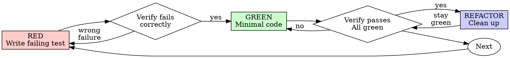

# Test-Driven Development (TDD)

## 概述

先写测试，观察它失败，再写最少的代码让它通过。

这个 skill 主要用于能在主机、模拟器或脚本环境里自动验证的逻辑，比如纯 C 模块、状态机、解析器、协议编码，或者能链接成桌面 demo / test binary 的代码。

如果仓库里没有现成 demo，就可以在项目根目录新建一个 `demo/YY-MM-DD_name/`，用 `CMake` 管理，把对应的源文件编进一个能在电脑上直接运行的程序，再用脚本或测试把它跑起来。

下面的示例默认用嵌入式 C / 纯 C 来说明，命令默认用 `ctest` / `cmake --build` / `make test` 这类常见流程。

涉及目标板、外设、刷写、温度、功耗、波形、时序、机械动作等硬件结果的部分，不属于“只靠 AI 就能完全验证”的范围。对这类改动，TDD 只负责你能抽出来的纯逻辑，最终板级行为仍然要靠人工上板或现场测量确认。

**核心原则：** 如果你没有亲眼看到测试失败，就不知道它是否真的测到了正确的东西。

**违背规则的字面就是违背规则的精神。**

## 适用边界

### 适合直接用 TDD
- 纯软件模块
- 业务逻辑、算法、状态机、配置解析、数据转换
- 可以在电脑上直接跑的 demo、单测、脚本化回归
- 没有现成 demo 时，也可以自己在项目根目录新建一个 `demo/YY-MM-DD_name/`，用 `CMake` 把相关源文件编成 host 可运行程序

### 只适合部分用 TDD
- 固件里能拆出来的纯逻辑
- 有硬件依赖，但可把输入输出边界隔离出来的代码
- 能先把判定逻辑放到 host test，再由板级代码调用的模块

### 不要把 TDD 当成完整验收
- 刷写目标板
- 加热时长、功耗、温度、波形、时序、抖动
- 传感器或执行器的真实物理表现
- 任何必须人工观察或测量才能确认的结果

## 何时使用

**始终：**
- New features
- Bug 修复
- 重构
- 行为变更

**例外（先问你的协作对象）：**
- 临时代码原型
- 生成代码
- 配置文件
- 只能通过硬件现场确认的最终行为

如果你开始想“这次先跳过 TDD 吧”，先停下来。这就是合理化。

## 铁律

```
可自动验证的生产代码 -> 先有失败测试
硬件现场结果 -> 先把能测的纯逻辑测掉，剩下的如实标注待人工确认
```

如果你先写了代码再写测试？删掉，重新开始。

**No exceptions:**
- 不要把它留作“参考”
- 不要边写测试边“改造”它
- 不要去看它
- 删掉就是删掉

始终从测试重新实现，就这样。

## 红-绿-重构



### RED - 写失败测试

写一个最小测试，说明应该发生什么。

嵌入式里更实用的写法通常是把要验证的逻辑抽成函数，链接进一个电脑上能跑的 demo 或 test binary，再用脚本喂输入、看输出、看退出码。

<Good>
```c
#include <assert.h>
#include <stdbool.h>

static int attempts = 0;

static bool flaky_operation(void) {
  attempts++;
  return attempts >= 3;
}

void test_retry_operation_retries_failed_operations_3_times(void) {
  attempts = 0;

  bool ok = retry_operation(flaky_operation, 3);

  assert(ok);
  assert(attempts == 3);
}
```
名字要清晰，测试真实行为，只测一件事
</Good>

<Bad>
```c
void test_retry_works(void) {
  bool ok = retry_operation(always_fail_then_succeed, 3);
  assert(ok);
}
```
名字含糊，测不到真实边界
</Bad>

**Requirements:**
- One behavior
- Clear name
- Real code (no mocks unless unavoidable)

### 验证 RED - 亲眼看它失败

**MANDATORY. Never skip.**

```bash
ctest --test-dir build -R test_retry_operation
```

确认：
- 测试失败了，而不是报错
- 失败信息是预期中的
- 失败原因是功能缺失，而不是拼写错误
- 如果是 host demo / 脚本回归，也要确认失败发生在你要验证的那条逻辑上

**测试通过了？** 说明你测的是已有行为。修测试。

**测试报错了？** 先修错误，再重新运行，直到它以正确方式失败。

### GREEN - Minimal Code

写最简单的代码让测试通过。

<Good>
```c
bool retry_operation(bool (*operation)(void), int max_attempts) {
  for (int i = 0; i < max_attempts; ++i) {
    if (operation()) {
      return true;
    }
  }
  return false;
}
```
只要够通过就行
</Good>

<Bad>
```c
bool retry_operation(bool (*operation)(void), int max_attempts, int backoff_ms) {
  // YAGNI
}
```
过度设计
</Bad>

不要加功能、不要顺手重构其他代码，也不要超出测试范围去“优化”。

### Verify GREEN - Watch It Pass

**MANDATORY.**

```bash
ctest --test-dir build -R test_retry_operation
```

确认：
- 测试通过
- 其他测试仍然通过
- 输出干净，没有错误或警告

**测试失败了？** 修代码，不修测试。

**其他测试也失败了？** 立刻修。

### REFACTOR - Clean Up

只有在变绿之后才做：
- 去重
- 改善命名
- 提取辅助函数

始终保持测试为绿，不要额外添加行为。

### Repeat

下一个功能就写下一个失败测试。

## Good Tests

| 质量 | 好 | 坏 |
|---------|------|-----|
| **最小** | 只测一件事。名字里有 “and” 就拆开。 | `test('validates email and domain and whitespace')` |
| **清晰** | 名字直接描述行为 | `test('test1')` |
| **表达意图** | 展示期望的 API | 让人看不出代码应该做什么 |

## Why Order Matters

**“我会在后面写测试来验证它能工作”**

代码写完之后再写的测试会立即通过。立即通过说明不了什么：
- 可能测错了东西
- 可能测的是实现，而不是行为
- 可能漏掉你忘记的边界情况
- 你从没见过它真正拦住 bug

先写测试会强迫你看到它失败，从而证明它确实在测试某些东西。

**“我已经手工测过所有边界情况了”**

手工测试是临时性的。你以为自己测全了，但实际上：
- 没有测试记录
- 代码变更后没法重跑
- 压力之下很容易漏项
- “我试的时候能跑”不等于全面

自动化测试才是系统化的。它每次都会以同样方式运行。

**“删掉 X 小时的工作太浪费了”**

这是沉没成本谬误。时间已经花掉了，现在的选择是：
- 删除后用 TDD 重写（再花 X 小时，但可信度高）
- 保留它，之后再补测试（30 分钟，但可信度低，而且很可能有 bug）

真正“浪费”的，是保留你不能信任的代码。没有真实测试的可运行代码，就是技术债。

**“TDD 太教条，务实就该灵活变通”**

TDD 本身就是务实的：
- 在提交前发现 bug（比提交后调试更快）
- 防止回归（测试会立刻抓住破坏）
- 记录行为（测试能说明怎么用代码）
- 支持重构（可以放心改，测试会抓住问题）

所谓“务实”的捷径，本质上就是在生产环境里调试，只会更慢。

**“先写代码后写测试也能达到同样目标，本质比形式重要”**

不对。后写测试回答的是“这段代码做了什么？”，先写测试回答的是“这段代码应该做什么？”

后写测试会被你的实现方式带偏。你测的是你做出来的东西，不是需求本身。你验证的是你记得的边界情况，不是你发现的边界情况。

先写测试会迫使你在实现前发现边界情况。后写测试只是验证你是否把所有东西都记住了，而你通常没有。

30 分钟的“事后补测试”不等于 TDD。你可能得到了覆盖率，却失去了测试本身确实有效的证明。

## Common Rationalizations

| 借口 | 现实 |
|--------|---------|
| “太简单，不用测” | 简单代码也会坏。写测试只要 30 秒。 |
| “我会后面再测” | 测试一写就通过，什么都证明不了。 |
| “后写测试也能达到同样目标” | 后写测试回答“这段代码做了什么？”，先写测试回答“这段代码应该做什么？” |
| “我已经手工测过了” | 临时测试不等于系统化测试。没有记录，也不能重跑。 |
| “删掉 X 小时太浪费了” | 这是沉没成本谬误。保留未验证的代码才是技术债。 |
| “留着当参考，先写测试” | 你会忍不住改造它，这还是后写测试。删掉就是删掉。 |
| “先探索一下再说” | 可以，但探索完就把它扔掉，然后从 TDD 重新开始。 |
| “测试难写说明设计不清楚” | 听测试的反馈：难测通常说明难用。 |
| “TDD 会拖慢我” | TDD 比调试更快。务实就是先写测试。 |
| “手工测更快” | 手工测试不能证明边界情况。每次改动都得重测。 |
| “现有代码本来就没测试” | 你是在改进它。给现有代码补测试。 |

## Red Flags - STOP and Start Over

- 先写代码，再写测试
- 实现之后才写测试
- 测试立即通过
- 说不清楚为什么失败
- 测试“以后再补”
- 合理化“就这一次”
- “我已经手工测过了”
- “先后写测试也能达到同样目的”
- “这讲的是精神，不是形式”
- “保留作参考”或“改造现有代码”
- “都花了 X 小时了，删掉太浪费”
- “TDD 太教条，我是在务实”
- “这个场景不一样，因为……”

**以上任何一种都意味着：删代码，按 TDD 重新开始。**

## Example: Bug Fix

**Bug：** 允许 0 波特率被接受

**RED**
```c
#include <assert.h>

void test_rejects_zero_baud_rate(void) {
  struct UartConfig cfg = { .baud_rate = 0 };
  struct UartResult result = validate_uart_config(&cfg);

  assert(result.error_code == UART_ERR_INVALID_BAUD_RATE);
}
```

**Verify RED**
```bash
$ ctest --test-dir build -R test_rejects_zero_baud_rate
FAIL: expected UART_ERR_INVALID_BAUD_RATE, got UART_OK
```

**GREEN**
```c
struct UartResult validate_uart_config(const struct UartConfig *cfg) {
  if (cfg->baud_rate == 0) {
    return (struct UartResult){ .error_code = UART_ERR_INVALID_BAUD_RATE };
  }
  return (struct UartResult){ .error_code = UART_OK };
}
```

**Verify GREEN**
```bash
$ ctest --test-dir build -R test_rejects_zero_baud_rate
PASS
```

**REFACTOR**
如果需要，把多个字段的校验抽出来。

## Verification Checklist

在标记工作完成之前：

- [ ] 可自动验证的新增函数/行为都有测试
- [ ] 每个测试都在实现前亲眼看过失败
- [ ] 每个测试都因“功能缺失”失败，而不是拼写错误
- [ ] 写了最少代码让测试通过
- [ ] 自动化测试全部通过
- [ ] 如果用了 host demo / 脚本回归，也已跑通
- [ ] 硬件相关行为已经拆出可测逻辑，剩余部分明确标注为人工确认
- [ ] 目标板刷写、温度、波形、加热、执行器等结果没有被冒充成“已自动验证”
- [ ] 测试使用真实代码，mock 只在不得已时使用
- [ ] 边界条件和错误场景都覆盖到

如果这些选项没法全部勾上，说明你跳过了 TDD。重新开始。

## When Stuck

| 问题 | 解决办法 |
|---------|----------|
| 不知道怎么测 | 先写你想要的 API，再先写断言，必要时问你的协作对象。 |
| 测试太复杂 | 说明设计太复杂。把接口简化。 |
| 只能 mock 所有东西 | 说明代码耦合太重。用依赖注入。 |
| 测试准备太大 | 提取辅助函数。还是复杂就继续简化设计。 |
| 只能上板才能看结果 | 先把能自动验证的逻辑拆出来，板级行为单独做人工确认。 |

## Debugging Integration

发现 bug 了？先写一个失败测试来复现它，然后按 TDD 循环走。测试既证明修复有效，也防止回归。

永远不要在没有测试的情况下修 bug。

## Testing Anti-Patterns

在添加 mock 或测试工具时，先读 `@testing-anti-patterns.md`，避免常见坑：
- 测试 mock 的行为，而不是现实行为
- 给生产类添加只给测试用的方法
- 在不了解依赖的情况下就开始 mock

## Final Rule

```
生产代码 -> 可自动验证部分先有测试，而且测试先失败过
硬件现场结果 -> 先把能测的纯逻辑测掉，目标板/人工确认没完成前，不得声称已验收
否则 -> 不是 TDD
```

没有你的协作对象许可，不允许破例。
