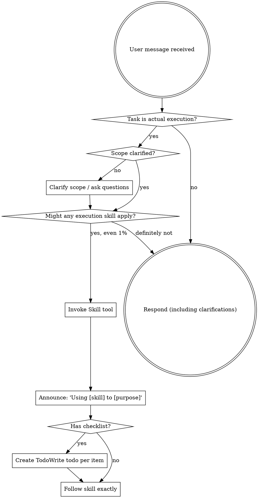

<SUBAGENT-STOP>
如果你是被派来执行某个具体任务的子代理，就跳过这个 skill。
</SUBAGENT-STOP>

这个 skill 只负责实际执行阶段的 skill 路由，不负责规划、架构或写计划。

<EXTREMELY-IMPORTANT>
如果你觉得某个执行类 skill 有哪怕 1% 的可能适用于当前实际执行工作，你就必须调用它。

只要某个执行类 skill 适用于你的任务，你就没有选择余地，必须使用它。

规划类 skill 不由这个入口分发。不要试图靠合理化绕过去。
</EXTREMELY-IMPORTANT>

## 指令优先级

Superpowers skills 会覆盖默认系统提示词行为，但**用户指令始终优先**：

1. **User's explicit instructions** (CLAUDE.md, GEMINI.md, AGENTS.md, direct requests) — highest priority
2. **Superpowers skills** — override default system behavior where they conflict
3. **Default system prompt** — lowest priority

如果 `CLAUDE.md`、`GEMINI.md` 或 `AGENTS.md` 说“不要用 TDD”，而某个 skill 说“始终使用 TDD”，那就照用户指令做。最终控制权在用户手里。

## 如何访问 Skills

**在 Claude Code 中：** 使用 `Skill` 工具。调用 skill 时，它的内容会被加载并展示给你，直接按内容执行。不要对 skill 文件使用 Read 工具。

**在 Copilot CLI 中：** 使用 `skill` 工具。Skills 会从已安装的插件中自动发现。`skill` 工具的行为和 Claude Code 的 `Skill` 工具一样。

**在 Gemini CLI 中：** 通过 `activate_skill` 工具激活 skills。Gemini 会在会话开始时加载 skill 元数据，并按需激活完整内容。

**在其他环境中：** 查看你所在平台的文档，确认 skills 是如何加载的。

## 平台适配

Skills 使用的是 Claude Code 的工具名。非 CC 平台请查看 `references/copilot-tools.md`（Copilot CLI）和 `references/codex-tools.md`（Codex）了解对应工具。Gemini CLI 用户会通过 GEMINI.md 自动加载工具映射。

# 使用 Skills

## 规则

**在任何回复或动作之前，先调用相关的执行类 skills。** 哪怕只有 1% 的可能适用，也要先调用检查一下。如果调用后发现不适用，那就不用继续使用它。规划、架构、写计划由对应 skill 自己处理，不在这里展开。

## Red Flags

下面这些想法一出现，就说明你在合理化，应该立刻停下：

| 想法 | 现实 |
|---------|---------|
| “这只是个简单问题” | 问题本身就是任务，先检查 skills。 |
| “我先需要更多上下文” | 先检查 skill，再问澄清问题。 |
| “我先看代码库” | Skills 会告诉你怎么查看，先检查。 |
| “我可以先快速看看 git / 文件” | 文件没有对话上下文，先查 skill。 |
| “我先收集信息” | Skills 会告诉你怎么收集信息。 |
| “这不需要正式 skill” | 如果有 skill，就用它。 |
| “我记得这个 skill” | Skills 会更新，要读最新版本。 |
| “这不算任务” | 只要是行动，就是任务，要检查 skills。 |
| “这个 skill 太重了” | 简单事也会变复杂，照用。 |
| “我先做这一点” | 任何动作前都要先检查。 |
| “这感觉很高效” | 没纪律的动作只会浪费时间，skills 就是用来避免这个。 |
| “我知道这是什么意思” | 知道概念不等于会正确使用 skill，先调用。 |

## Skill Priority

当多个 skill 都可能适用时，按这个顺序来：

1. **先用门禁类 skills**（例如 `systematic-debugging`、`verification-before-completion`）- 它们决定先查什么、先验证什么、什么时候可以下结论
2. **再用执行类 skills**（例如 `using-git-worktrees`、`test-driven-development`、`subagent-driven-development`）- 它们指导如何组织工作区、如何落地实现、如何推进任务

“我们来做 X” -> 先把实际执行范围和意图问清楚，再用执行类 skills。
“修这个 bug” -> 先 debugging，再用领域相关 skills。

## Skill Types

**门禁类**（debugging、verification-before-completion）：严格执行，不要把纪律改没了。

**执行类**（worktree、TDD、subagent-driven-development）：按步骤推进，不要把流程跳掉。

**灵活**（patterns）：根据上下文调整原则。

具体属于哪一类，由 skill 自己说明。

## User Instructions

用户指令说的是“做什么”，不是“怎么做”。“加 X”或“修 Y”并不代表可以跳过实际执行工作流。
