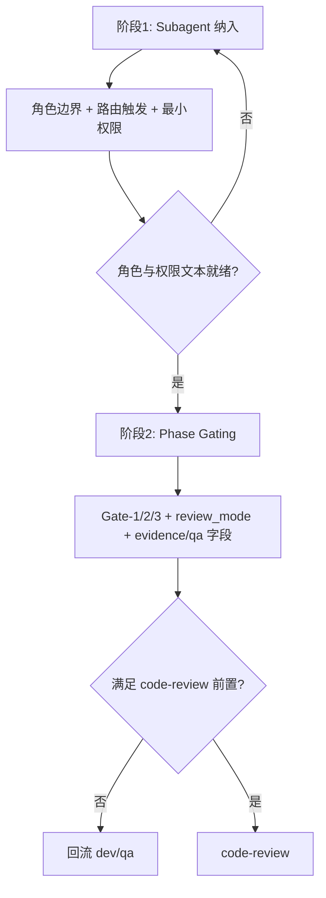

# OpenCode Explore 纳入与 Review Phase Gating 两阶段实施计划（修订）

> **For Claude:** REQUIRED SUB-SKILL: Use superpowers:executing-plans to implement this plan task-by-task.

**Goal:** 在现有 `orchestrator + {dev, qa, review, debug, triage}` 体系中，先完成 subagent 纳入（含原生 `explore` 对齐与可选新角色），再落地阶段门控（phase gating）与 `review_mode`，彻底避免 `review` 过早介入。

**Architecture:** 采用“两阶段上线”策略：
1. **阶段1（Subagent 纳入）**：先补齐角色边界、路由触发条件、最小工具权限矩阵。
2. **阶段2（Gates 落地）**：再启用 Gate-1/2/3、`review_mode`、统一 evidence/qa 判定字段，保证 `code-review` 只在实现与验证都完成后触发。

**Tech Stack:** `opencode/AGENTS.md`、`opencode/agents/*.md`（本计划仅描述拟改动，不在本任务实际修改这些文件）、Markdown。

---

## 0. 本次修订目的（相对上一版）

本版计划用于吸收上一轮 review 阻断项，重点修复：

- Gate-1/2/3 文本可执行性不足；
- evidence 结构不统一，`qa` 判定字段不明确；
- 预算描述不够可执行；
- 新增 subagent 命名与职责边界不清；
- 未明确引用上游原生 `explore` 实现来源。

## 1. 上游对齐（OpenCode 原生 Explore 依据）

> 以下链接作为“规范锚点”，用于说明本计划与上游能力对齐，不代表本任务要直接改 upstream。

- OpenCode v1.2.15 `agent.ts`：
  - https://github.com/anomalyco/opencode/blob/v1.2.15/packages/opencode/src/agent/agent.ts
- OpenCode v1.2.15 `explore.txt`：
  - https://github.com/anomalyco/opencode/blob/v1.2.15/packages/opencode/src/agent/prompt/explore.txt

**对齐结论（计划约束）：**

- `explore` 是 **native subagent**；
- 本仓库不新增 `opencode/agents/explore.md`（避免伪实现）；
- 仅在后续实施中把 `explore` 纳入 `AGENTS.md/orchestrator.md` 路由与规则文本（本任务不实际改规则文件）。

## 2. 非目标与硬约束

### 非目标

- 不改变 `triage` manual-only 原则。
- 不引入复杂评分系统（MVP 仅落地可执行 gate 与字段约束）。
- 不在本任务修改任何规则文件（仅更新本计划文档）。

### 硬约束

- `code-review` 触发必须在 `dev done + evidence 完整 + qa done` 之后。
- `plan-review` 仅 **opt-in**（默认不强制）。
- 任务协议字段继续使用：`expected_outputs`、`acceptance_criteria`、`risks`。

## 3. 两阶段实施总览



---

## 阶段1：Subagent 纳入（先做）

### 3.1 子代理职责矩阵（含可选新增）

| Subagent | 类型 | 核心职责 | 触发条件（摘要） | 不做什么 |
|---|---|---|---|---|
| `explore` | 原生 | 快速摸底、定位文件/上下文、收敛 unknowns | 需求不完整/上下文缺失/跨目录不确定 | 不承诺修复、不做最终验收 |
| `scoper`（或 `spec`） | 可选新增 | 把模糊需求结构化为可执行任务协议 | 需求边界模糊、范围膨胀风险高 | 不写实现代码 |
| `impact` | 可选新增 | 变更影响面评估（模块、依赖、回归路径） | 变更跨模块或高回归风险 | 不替代 qa 验证 |
| `security` | 可选新增 | 安全与敏感路径审查（权限、注入、泄露） | 涉及鉴权、输入处理、敏感数据 | 不替代 code-review 全量审查 |
| `debug` | 既有 | 复现问题、定位根因、修复证据链 | 明确为 bug/回归定位任务 | 不负责前置摸底探索 |
| `dev` | 既有 | 最小必要实现并提供可验证证据 | 方案已定、进入实现阶段 | 不做最终放行 |
| `qa` | 既有 | 执行验证并给出通过/失败判定 | `dev` 有可测产出后 | 不替代 review 建议 |
| `review` | 既有 | `plan-review` / `code-review` 双模式审查 | 见阶段2 Gate 约束 | 不越过 gate 提前 code-review |
| `triage` | 既有（manual） | 疑难问题人工升级分析 | 超重试/高不确定阻塞 | 不自动触发 |

> 命名建议：文档统一写法 `scoper(spec)`，落地时二选一，避免一版文档内混用。

### 3.2 路由触发条件（MVP）

| 条件 | 路由 |
|---|---|
| 需求不清、上下文不足、未知项多 | `explore`（先于 dev） |
| 范围边界不清且需形成任务包 | `scoper(spec)`（可选） |
| 变更跨模块、回归风险高 | `impact`（可选） |
| 涉及敏感路径/权限/输入安全 | `security`（可选） |
| 明确 bug 定位/复现 | `debug` |
| 可执行任务已明确 | `dev` |

### 3.3 工具最小权限矩阵（至少四类）

| Subagent | 默认工具权限（最小） | 说明 |
|---|---|---|
| `explore` | `read`, `glob`, `grep`（必要时受控 `bash` 只读） | 只做信息收敛，禁止写文件 |
| `scoper(spec)` | `read`, `glob`, `grep` | 生成结构化任务，不改代码 |
| `impact` | `read`, `glob`, `grep`（可选只读 `bash`：依赖图/变更查询） | 产出影响面清单 |
| `security` | `read`, `glob`, `grep`（可选只读 `bash`：SAST/规则扫描） | 产出风险分级与缓解建议 |

> 本阶段仅定义“最小权限策略文本”；是否开放额外工具通过灰度开关控制。

### 3.4 阶段1任务列表（2-10 分钟粒度）

<details>
<summary><strong>Task S1-1 ~ S1-6（折叠展开）</strong></summary>

#### Task S1-1：写入原生 explore 对齐说明（2-4 分钟）
- **目标**：在 `AGENTS/orchestrator` 文本纳入 native `explore` 说明。
- **验收**：明确“native、无 explore.md、仅纳入路由文本”。

#### Task S1-2：统一新增 subagent 命名（3-5 分钟）
- **目标**：统一 `scoper(spec)`、`impact`、`security` 表述。
- **验收**：同一文档内无冲突命名。

#### Task S1-3：补齐路由触发条件表（4-6 分钟）
- **目标**：按条件映射子代理，避免误派发。
- **验收**：`explore/debug` 边界可判定。

#### Task S1-4：补齐工具最小权限矩阵（4-6 分钟）
- **目标**：至少覆盖 `explore/scoper/impact/security`。
- **验收**：每个角色有“默认最小权限 + 说明”。

#### Task S1-5：可执行预算文本化（3-5 分钟）
- **目标**：为 `explore` 定义轮次、单轮时长、总占比上限。
- **验收**：可直接用于 gate 判定，无“酌情”模糊字样。

#### Task S1-6：灰度策略与回滚入口（2-4 分钟）
- **目标**：写明默认开关、灰度范围、回滚动作。
- **验收**：出现阻塞时可 1 步降级。

</details>

### 3.5 Explore 预算（可执行版）

- 默认预算：最多 **2 轮**，每轮 **<= 8 分钟**，单任务累计 **<= 总时长 25%**。
- 总时长口径说明：`总时长` 指 orchestrator 在 **Phase 0** 的工作量预估（实现+验证），**不含外部等待**（如人工补充信息、外部系统排队/审批）。
- 退出条件（满足任一）：
  1) unknowns 降到可执行阈值；
  2) 达预算上限；
  3) 连续两轮无新增信息。
- 超预算动作：
  - 转 `need-info` 请求人工补充；或
  - 若问题转为故障定位，切换 `debug`。

---

## 阶段2：Phase Gating + review_mode + 证据结构（后做）

### 4.1 Gate 文本修订（防 review 过早）

#### Gate-1（Plan Ready → 可选 `plan-review`）

- 前置（全部满足）：
  - 任务拆分、目标文件、验收标准、风险已明确；
  - 任务协议字段齐全（`expected_outputs/acceptance_criteria/risks`）。
- 行为：
  - `plan-review` **仅 opt-in**；
  - 仅评审计划质量，不评审未发生代码细节。

#### Gate-2（`code-review` 前置硬门）

- 前置（全部满足）：
  - `dev.status == done`；
  - `dev.evidence.commands` 至少 1 条命令 + `result_summary`；
  - `qa.status == done` 且 `qa.verdict == pass`。
- 强制禁止：
  - 任一条件不满足时，**禁止触发 `review_mode=code-review`**。

#### Gate-3（验证回流）

- 若 `qa.verdict == fail`：
  - orchestrator 回流 `dev`（必要时 `debug`）继续修复；
  - 修复并补齐证据前，不得进入 `code-review`。
- 若 `qa.verdict == blocked`：
  - 进入 `need-info`/`blocked` 分支并记录阻塞项；
  - 阻塞解除前，**禁止**进入 `code-review`，且不强制回流 `dev`。

### 4.2 `review_mode` 规则

| mode | 触发时机 | 输入要求 | 输出要求 |
|---|---|---|---|
| `plan-review` | Gate-1 后（opt-in） | 计划、风险、验收标准 | 结构化改进建议（不下代码结论） |
| `code-review` | Gate-2 满足后 | 变更摘要 + `dev/qa evidence` | 严重级别分层建议 + 可执行修复项 |

### 4.3 evidence 结构（统一模板）

```yaml
dev:
  status: todo | in_progress | done | need-info | blocked | cancelled
  evidence:
    commands:
      - cmd: "<verification command>"
        result_summary: "<pass/fail + 关键输出>"
    artifacts: []

qa:
  status: todo | in_progress | done | need-info | blocked | cancelled
  verdict: pass | fail | blocked
  evidence:
    checks:
      - name: "<check name>"
        result: pass | fail
        summary: "<关键结论>"
```

---

## 5. 拟改动文件范围（实施阶段参考）

> 本任务不改这些文件，仅在计划中列出后续实施范围。

- `opencode/AGENTS.md`
- `opencode/agents/orchestrator.md`
- `opencode/agents/review.md`
- `opencode/agents/debug.md`
- （可选）`opencode/agents/dev.md`
- （可选）`opencode/agents/qa.md`

## 6. 验证命令（针对“计划文本完整性”）

1) 检查阶段1关键字

```bash
rg -n "阶段1|Subagent|explore|scoper|impact|security|最小权限" docs/plans/2026-03-01-opencode-explore-and-review-gating.md
```

2) 检查 Gate 与 review 约束

```bash
rg -n "Gate-1|Gate-2|Gate-3|plan-review|code-review|opt-in|qa\.verdict" docs/plans/2026-03-01-opencode-explore-and-review-gating.md
```

3) 检查 upstream 引用

```bash
rg -n "agent\.ts|explore\.txt|anomalyco/opencode|v1\.2\.15" docs/plans/2026-03-01-opencode-explore-and-review-gating.md
```

## 7. 验收清单

- [x] 计划拆成“两大阶段”：先 subagent 纳入，再 phase gating。
- [x] 阶段1含 2-10 分钟粒度任务列表。
- [x] 含 subagent 职责矩阵（`explore/scoper(spec)/impact/security/debug/dev/qa/review/triage`）。
- [x] 含工具最小权限矩阵（至少 `explore/scoper/impact/security`）。
- [x] 明确 `code-review` 必须在 `dev done + evidence + qa done(pass)` 后触发。
- [x] 明确 `plan-review` 仅 opt-in。
- [x] 明确 `explore` 为 native subagent，且不新增 `explore.md`。
- [x] 引用 OpenCode v1.2.15 上游 `agent.ts + explore.txt` 链接。

## 8. 风险与缓解

| 风险 | 影响 | 缓解 |
|---|---|---|
| 规则过多导致执行变慢 | 中 | 先灰度开启可选 subagent，保留回滚入口 |
| 命名不统一导致派发混乱 | 中 | 固定文档命名 `scoper(spec)` 并在实施时二选一 |
| evidence 字段落实不一致 | 高 | 在 Gate-2 强制要求结构化字段，缺失即禁止 code-review |
